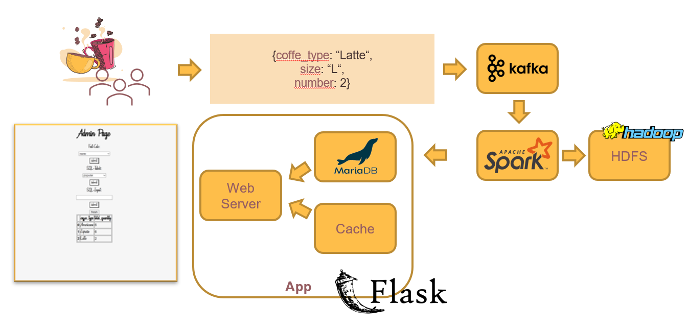

# Dokumentation

## Idee der Anwendung

Die Kaffeekultur hat sich in den letzten Jahren rasant entwickelt und ist weit über den klassischen Filterkaffee hinausgewachsen. Espresso, Cappuccino, Latte Macchiato oder Affogato sind nur einige der vielen Kaffeevariationen, die heute in Coffeeshops auf der ganzen Welt angeboten werden. Mit der wachsenden Vielfalt der Angebote wächst jedoch auch die Herausforderung für die Coffeeshops, die Vorlieben ihrer Kunden zu verstehen und ihr Angebot entsprechend anzupassen. 

Um diese Herausforderung zu bewältigen, stellt die neu entwickelte Webapp, die als Kaffeedatenbank fungiert, eine revolutionäre Lösung dar. Sie ermöglicht es sowohl Kunden als auch Coffeeshops, sich in einem gemeinsamen System zu registrieren und zu interagieren. Kunden können ihre Bestellungen tätigen und die Coffeeshops zu bewerten, während Coffeeshops die Möglichkeit haben, ihr Angebot anzupassen und Bestellungen einzusehen. 

Doch der wahre Wert dieser Webapp liegt in ihrem einzigartigen Big-Data-System. Mit jedem Getränk, das bestellt wird, wird ein weiterer Datensatz erzeugt und gespeichert. Über die Zeit entsteht so eine riesige Datenbank, die das Kaufverhalten der Kunden in verschiedenen Coffeeshops detailliert abbildet. Diese Daten können dann genutzt werden, um eine Liste der meistverkauften Produkte zu erstellen.

Diese Liste ist mehr als nur eine Aufzählung von Bestsellern. Sie ist ein leistungsstarkes Werkzeug für die Geschäftsstrategie eines jeden Coffeeshops. Mit ihrer Hilfe können Trends erkannt und vorausschauend auf Veränderungen in der Nachfrage reagiert werden. Auf diese Weise ermöglicht die Webapp den Coffeeshops, ihr Angebot stets aktuell und attraktiv zu gestalten und damit ihre Wettbewerbsfähigkeit zu stärken.

In einer Welt, in der Daten als das neue Gold gelten, stellt diese Webapp eine Brücke zwischen traditionellem Handwerk und digitaler Innovation dar. Sie hilft Coffeeshops, in der heutigen datengetriebenen Welt erfolgreich zu sein, und verbessert gleichzeitig das Kaffeeerlebnis für Kunden weltweit. Damit setzt sie neue Maßstäbe für die Kaffeekultur des 21. Jahrhunderts.

## Architektur/Entwurf

Im Kontext von Big Data Messaging (Kafka) haben wir Nachrichten, die gemäß dem folgenden JSON-Schema aufgebaut sind: {coffee_type: "Latte", size: "L", number: 2}, zur Datenverarbeitung an Spark übermittelt.

### Big Data Processing (Spark):
Innerhalb von Spark haben wir die aus Kafka stammenden Informationen so aggregiert, dass die Anzahl identischer Kaffeesorten aufsummiert wird. Dieser Prozess findet innerhalb jeden einzelnen Batchs statt.

### Data Lake (Hadoop):
Spark subscibet sich auf die Topics die Kafka erstellt.

### Datenbank (MariaDB/MySQL):
Unsere zentrale Datenbank, die auf der relationalen Datenbank MariaDB beruht, fungiert als Speichermedium für sämtliche Interaktionen innerhalb der Webapplikation. Um die Funktionalitäten unserer App zu veranschaulichen, haben wir diese bereits mit repräsentativen Beispieldaten bestückt. Zudem stellt MariaDB eine unverzichtbare Schnittstelle zwischen Apache Spark und unserer Webapplikation dar. Um unsere beliebtesten Kaffeesorten zu visualisieren, führen wir eine Selektionsabfrage durch, die über alle Chargen aggregiert.

### Webapp (Flask):
Unsere auf Flask basierende Webapplikation bildet das Herzstück unserer Anwendung und agiert als umfassende Kaffeedatenbank mit einem eingebetteten Anmeldesystem für sowohl Kunden als auch Coffeeshop-Inhaber. Zur Erweiterung ihres Leistungsspektrums haben wir sie mit einer Big Data-Komponente bereichert, welche alle Bestllungen dokumentiert. Dieser ausgebaute Bereich der Applikation ist durch die Administrationsseite zugänglich und kann unkompliziert über ein Dropdown-Menü gesteuert werden. Den überwiegenden Teil dieser Anwendung hatten wir bereits im Rahmen eines früheren Universitätsprojekts entwickelt, wobei der entscheidende Unterschied darin lag, dass wir eine Postgres-Datenbank verwendet hatten. Dies erforderte einen erheblichen Anpassungsaufwand, einschließlich der Modifikation des umfangreichen SQL-Codes sowie der vollständigen Umstrukturierung der Flask-App und der Javascript-Dateien, da die Datenbankantworten ein anderes Format aufwiesen und wir alternative Datenbank-Connectoren benötigten.

### Cache (pymemcache):
Wir haben ein Caching-System, um die Datenbankzugriffe zu minimieren und dadurch die Performance unserer App zu steigern. Da wir mit einer Flask App Arbeiten verwenden wir hierbei das Modul pymemcache.

## Installation

### Docker installieren
sudo apt update ; sudo apt install -y apt-transport-https docker.io
sudo usermod -aG docker $USER && newgrp docker

### Minikube installieren 
auf https://github.com/kubernetes/minikube/releases/tag/v1.30.1 Datei: minikube_1.30.1-0_amd64.deb herunterladen
sudo dpkg -i minikube_1.30.1-0_amd64.deb

### Install Helm
curl https://baltocdn.com/helm/signing.asc | gpg --dearmor | sudo tee /usr/share/keyrings/helm.gpg > /dev/null
echo "deb [arch=$(dpkg --print-architecture) signed-by=/usr/share/keyrings/helm.gpg] https://baltocdn.com/helm/stable/debian/ all main" | sudo tee /etc/apt/sources.list.d/helm-stable-debian.list
sudo apt-get update ; sudo apt-get install helm

### Minikube starten
minikube start --cpus=8 --memory=6500MB --addons=ingress

### Install Strimzi Operator and Kafka Cluster
helm repo add strimzi http://strimzi.io/charts/
helm install my-kafka-operator strimzi/strimzi-kafka-operator
kubectl apply -f https://farberg.de/talks/big-data/code/helm-kafka-operator/kafka-cluster-def.yaml

### Install Hadoop
helm repo add pfisterer-hadoop https://pfisterer.github.io/apache-hadoop-helm/
helm install my-hadoop-cluster pfisterer-hadoop/hadoop --set hdfs.dataNode.replicas=1 --set yarn.nodeManager.replicas=1

### Install Skaffold
curl -Lo skaffold https://storage.googleapis.com/skaffold/releases/latest/skaffold-linux-amd64 && sudo install skaffold /usr/local/bin/

### Copy application to server 
scp -r use-case/ ubuntu@IP-ADRESSE-DER-MASCHINE: (oder per VS Code kopieren)

### Run the application 
skaffold dev

### parralel zu skaffold dev
minikube tunnel

